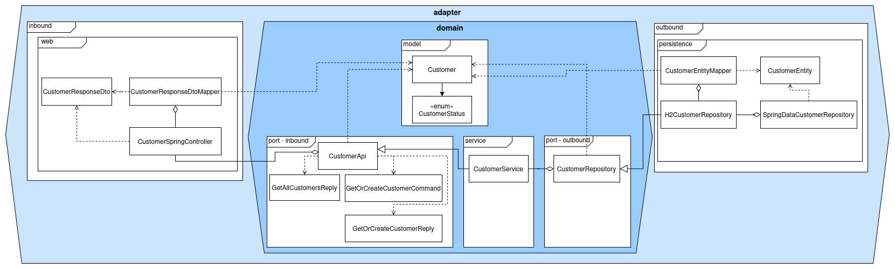
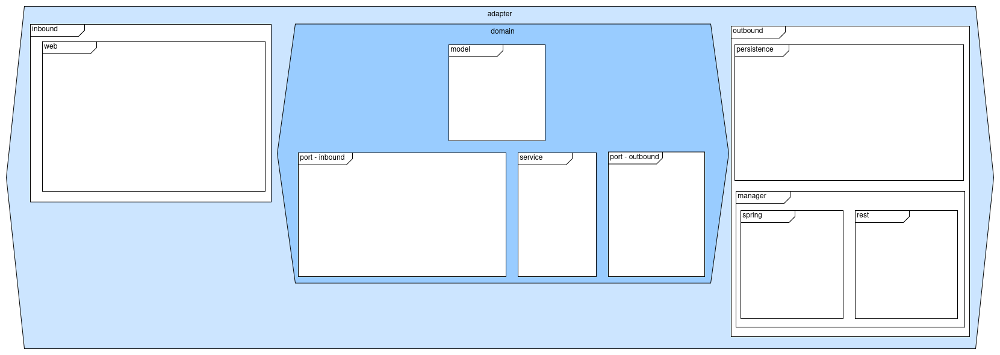
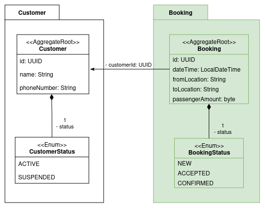
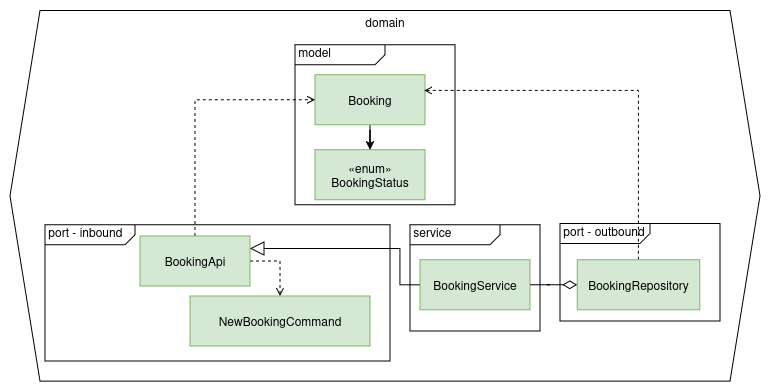
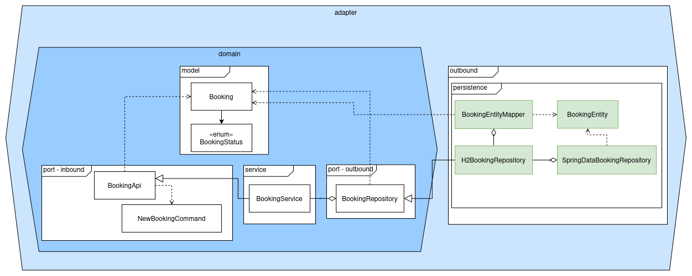
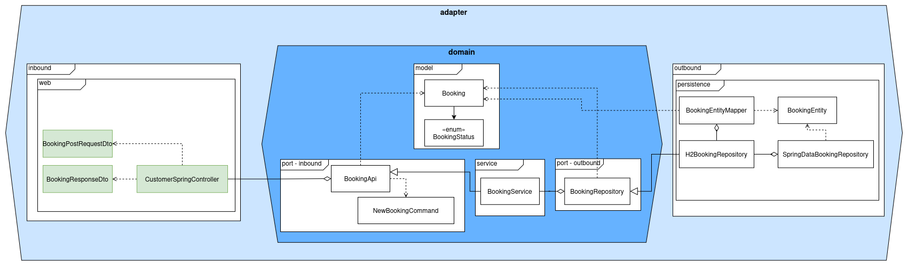
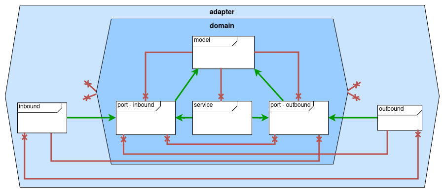
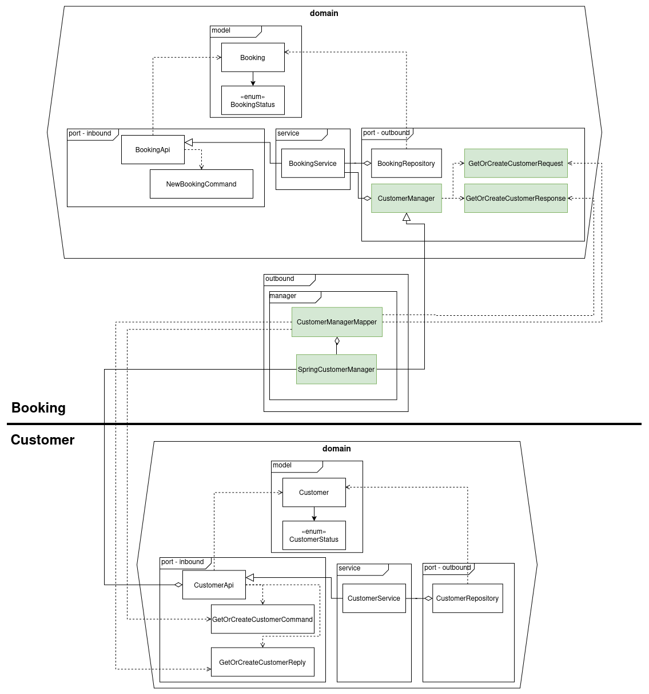

# Hexagonal Architecture Workshop

Welkom! In deze workshop gaan we aan de slag met het bouwen van een applicatie volgens de principes van hexagonal architecture, ook wel bekend als ports and adapters architecture. We gaan zien hoe deze architectuurstijl kan worden toegepast
in een monolithische applicatie die bestaat uit meerdere domeinen van een kleine taxibedrijf casus.

## Programma

15:45-16:00: introductiepresentatie tot hexagonal architectuur door een layered architecture voorbeeld stap voor stap om te zetten naar hexagonal  
16:00-16:50: uitvoeren opdrachten ter uitwerking van de casus  
16:50-17:00: overview gerealiseerde applicatie

## Leerdoelen

1. Hoe kan je op een onderhoudbare manier een grote monolithische applicatie neerzetten aan de hand van de hexagonal stijl?
2. Hoe kunnen technische implementaties worden verwisseld zonder dat dit impact heeft op de domeinspecifieke functionaliteiten?
3. Hoe valideren we de architectuurregels van een hexagonal architectuur met ArchUnit?
4. Hoe kunnen we aan de hand van Spring Modulith meerdere bounded contexts (domeinen) met goed gedefinieerde afhankelijkheden in een monolithische applicatie bouwen?

# Onboarding

**Vereiste software:**

- JDK 17 of hoger
- Maven 3.6+ (of gebruik `mvn` wrapper scripts: `./mvnw` op Linux/Mac of `mvnw.cmd` op Windows)  
  Binnen deze workshop wordt er gewerkt met een set aan dependencies welke al zijn meegegeven in de pom.xml van het project.

**Startpunt:** clone de `starter-new` branch van de repository en open deze in je IDE.

**Belangrijke commands**:
We gaan aan de hand van tests in `test.java.nl.quintor.workshop` de functionaliteit van de applicatie doorlopend valideren, dus het is belangrijk dat je weet hoe je deze kan runnen:  
Optie 1: gebruik je automatisch geconfigureerde IDE om de test directory of individuele tests (wanneer aangegeven) te runnen. Verwijder voor de zekerheid altijd eerst de `/target/` directory  
Optie 2: gebruik het maven command `mvn clean verify` om alle tests te runnen. Wil je een specifieke test runnen, gebruik dan `mvn -Dtest=TestClassName#testMethodName test`

**Opschonen van gecompileerde bestanden:** `mvn clean` (of verwijder `/target`)

# De opdracht

We gaan een deel van een taxibedrijf casus uitwerken in een bestaand project in hexagonale architectuur en modulaire monoliet stijl.
Het doel van de architectuur is om de verschillende domeinen geïsoleerd op te zetten terwijl het een monolitische applicatie betreft en hierbij de domein implementatie ook zoveel mogelijk techniek onafhankelijk te laten zijn.
Dit betekent dat we slim moeten omgaan met de communicatie tussen domeinen en bij de koppeling met specifieke technologieën.

## Casus 'taxibedrijf Rëbu'

Het systeem omvat functionaliteiten voor klanten en planners om te komen tot taxiritafspraken.
In de gebruikersflow (zie event storming afbeelding) kan een klant simpelweg met zijn telefoonnummer een boeking aanvragen zodat een planner hiermee aan de slag gaat.
Het systeem bepaalt initieel de beschikbaarheid en de planner maakt hierop beslissingen.
Kan een boeking niet direct worden vervuld, dan kan het systeem ook alternatieve opties bepalen.
Lukt het echt niet, dan wordt een aanvraag geweigerd.


Vanuit de event storming zijn de volgende drie domeinen te onderkennen:

  
(vertaald: Customer, Booking, Planning)
U = upstream
D = downstream

In scope van de workshop is een gedeeltelijke realisatie van de Customer en Booking context (waarbij booking afhankelijk is van upstream Customer).
We pakken hierbij de "aanvraag indienen" en "klant registreren" commands.

## Beginstaat van het project

Meegeleverd op de workshop starter branch is een Java Spring Modulith project met een geïmplementeerde `customer` module en package opzet van de `booking` module.
In de `customer` module zijn er een tweetal REST endpoints beschikbaar en een Modulith named interface `CustomerApi` die registratie functionaliteit beschikbaar stelt die we gaan gebruiken in de Booking module later in de workshop.



Deze `booking` module zullen we stapsgewijs implementeren volgens de hexagonal architecture stijl. De packagestructuur ziet er als volgt uit:  
  
Meer vooraf eerst lezen over deze opzet?, zie [Hexagonal.md](docs/hexagonal.md).

## Stap 1: Implementeren van het Booking domein

We gaan beginnen met de domeinlaag van de Booking module (`nl.quintor.workshop.booking.domain` package), de packagestructuur is al aanwezig in het project en zit als volgt in elkaar:

- `model` bevat de domeinmodellen
- `port.inbound` bevat interfaces die business functionaliteit van het domein beschikbaar stellen
- `port.outbound` bevat interfaces die de domeinlaag nodig heeft van de buitenwereld, zoals repositories
- `service` bevat de implementatie van de business logica van het domein, is afhankelijk van de Port.outbound interfaces en implementeert de Port.inbound interfaces

**A.** Maak een `Booking` en `BookingStatus` klasse aan in de `model` package met properties op basis het onderstaande diagram.
Maak van het model een lombok value en builder klasse.  


```java

@Value
@AllArgsConstructor
@Builder
public class Booking {
    UUID id;
    UUID customerId;
    LocalDateTime dateTime;
    String fromLocation;
    String toLocation;
    byte passengerAmount;
    @Default
    BookingStatus status = BookingStatus.NEW;
}

public enum BookingStatus {
    NEW,
    ACCEPTED,
    CONFIRMED
}
```

**B.** We willen uiteindelijk een boeking in een relationele database opslaan, maar in het domein willen we niet van technische implementatie afhankelijk zijn.
Er moet echter wel een interface beschikbaar komen waarop we een actie voor het opslaan van het zojuist aangemaakte booking model kunnen uitvoeren.
Maak daarom een `BookingRepository` interface aan in de `port.outbound` package met een `save` methode met `Booking` als parameter en als return type.
Dit is dus onze outbound port definitie voor de persistentie van het domein volgens hexagonal architecture.
In stap 2 zullen we hiervoor een outbound adapter voor implementeren.
**Met uitzondering van de `model` package, mag de interface geen andere dependencies hebben op andere packages.**

```java
public interface BookingRepository {
    Booking save(Booking booking);
}
```

**C.** Nu gaan we de inbound port, welke de API van het domein beschrijft, definiëren.
Maak een `NewBookingCommand` record aan in de `port.inbound` package:

```java
public record NewBookingCommand(String customerName, String customerPhoneNumber, LocalDateTime dateTime, String fromLocation, String toLocation, byte passengerAmount) {}
```

Hoewel de `Booking` domeinklasse een `customerId` bevat, willen we in onze functionaliteit voor het aanmaken van een booking niet een customer id ontvangen.
Het moet voor de klant mogelijk zijn simpelweg een telefoonnummer en naam op te geven bij de aanvraaginformatie.
Het betreft hier een command die overeenkomt met het _'Aanvraag indienen'_ command in het eerdere event storming diagram.
Een command veranderd de gegevenstoestand van een domeinobject als deze succesvol is uitgevoerd.
Het koppelen van de booking aan een al dan niet bestaand klantprofiel op basis van het telefoonnummer regelen we in een latere stap.

**D.** Nu kunnen we het command beschikbaar stellen via een interface met de aangemaakte `NewBookingCommand` als parameter en een `Booking` als return type.
Maak een `BookingApi` interface aan in de `port.inbound` package met een methode `createBooking` hiervoor.
**Met uitzondering van de `model` package, mag de interface geen andere dependencies hebben op andere packages.**

```java
public interface BookingApi {
    Booking createBooking(NewBookingCommand command);
}
```

**E.** Er staan nu een model, inbound port en outbound port klaar.
Dan is het nu tijd om de `BookingApi` te implementeren in een service klasse.
Maak in de `service` package een `BookingService` klasse aan die de `BookingApi` interface implementeert.
Voeg een memberfield voor de `BookingRepository` interface.
In de `createBooking` methode moet een `Booking` object worden gecreëerd op basis van de informatie in de `NewBookingCommand` en vervolgens worden opgeslagen via de `BookingRepository`.
Voor nu gebruiken we een random UUID voor de `customerId`.
Voeg de lombok `@AllArgsConstructor` annotatie toe aan de klasse zodat we later deze kunnen gaan gebruiken.

**Optioneel: meer weten over "ports", zie ['Definition of Inbound and Outbound Ports'](https://scalastic.io/en/hexagonal-architecture-domain/#1-definition-of-inbound-and-outbound-ports) (5 min)**

```java
@RequiredArgsConstructor
public class BookingService implements BookingApi {
    private final BookingRepository bookingRepository;

    @Override
    public Booking createBooking(NewBookingCommand command) {

        var booking = Booking.builder()
                .customerId(UUID.randomUUID())
                .toLocation(command.toLocation())
                .fromLocation(command.fromLocation())
                .dateTime(command.dateTime())
                .passengerAmount(command.passengerAmount())
                .build();

        return bookingRepository.save(booking);
    }
}
```

De service klasse heeft als 'logica' nu alleen het omzetten van het command naar een Booking, maar dit is ook de plek om business logica te plaatsen.
Het is dan minder toepasselijk om een mapper te maken die command naar booking omzet, ook gezien de properties niet één op één overeenkomen.
Daarom maken we hier deze keuze om programmatisch NewBookingCommand om te zetten.

Als het goed is, ziet de implementatie van het domein binnen de booking module er nu als volgt uit:  


## Stap 2: Booking persistentie

Er staat nu een domeinlaag met duidelijk gedefinieerde operaties voor zowel inbound als outbound.
De **ports moeten nu worden geïmplementeerd met de daadwerkelijke techniek.**
Wat we hier gebruiken maakt voor het domein niet uit, we gaan namelijk technische adapters schrijven die dit op zich nemen.

**A.** Voor de opslag van de gegevens gebruiken we relationele database.
We gaan dit realiseren door gebruik te maken van Spring Data JPA en een in-memory H2 database.
Bij het aanmaken van het model hebben we niet de bekende JPA-annotaties toegevoegd zoals je dat mogelijk gewend bent in een lagenarchitectuur.
Het model willen we voor de loskoppeling van database technologie dan ook zo houden.  
We hebben echter wel een entity variant nodig van `Booking` klasse die wél JPA-annotaties heeft.
Kopieer `Booking` als `BookingEntity` naar `adapter.outbound.persistence` en voeg de JPA-annotaties `@Entity, @Id & @GeneratedValue` toe op de gepaste plaatsen.
Verander de Lombok `@Value` annotatie in `@Data` zodat dat de entity manager dynamisch de objecten kan aanpassen.

```java
@Data
@NoArgsConstructor
@AllArgsConstructor
@Entity
public class BookingEntity {
    @Id
    @GeneratedValue
    private UUID id;
    private UUID customerId;
    private LocalDateTime dateTime;
    private String fromLocation;
    private String toLocation;
    private byte passengerAmount;
    private BookingStatus status;
}
```

**B.** Zoals je wellicht weet van Spring Data JPA-repositories, moet er een interface worden aangemaakt die overerft van `JpaRepository`.
Maak daarom de onderstaande `SpringDataBookingRepository` interface in dezelfde package aan voor het opslaan van de `BookingEntity`.

```java
  @Repository
  public interface SpringDataBookingRepository extends JpaRepository<BookingEntity, UUID> {
  }
```

**C.** Zoals je wellicht nu ziet is de `BookingRepository` interface van het domein niet hetzelfde als de `SpringDataBookingRepository` interface.
Met een adapter klasse in de outbound adapter laag van de hexagonal architecture zullen we deze twee aan elkaar moeten koppelen.
We moeten dus een adapter klasse maken die de `BookingRepository` interface implementeert en intern gebruik maakt van de `SpringDataBookingRepository` interface en ook de mapping verzorgt tussen de JPA entity `BookingEntity` en de domein klasse `Booking`.

Maak in dezelfde package de onderstaande `BookingEntityMapper` klasse aan die mapstruct gebruikt voor het mappen tussen `Booking` en `BookingEntity` objecten.

```java
@Mapper(componentModel = "spring")
public interface BookingEntityMapper {

    BookingEntity toEntity(Booking booking);

    Booking toDomain(BookingEntity entity);
}
```

Maak in dezelfde package de `H2BookingRepository` klasse aan die de `SpringDataBookingRepository` en `BookingEntityMapper` klassen gebruikt om de interface `BookingRepository` van de domein laag te implementeren.
De klasse is geannoteerd met `@Repository` zodat deze adapter klasse als spring bean beschikbaar komt.

```java
@Repository
@RequiredArgsConstructor
public class H2BookingRepository implements BookingRepository {
    private final BookingEntityMapper bookingEntityMapper;
    private final SpringDataBookingRepository springDataBookingRepository;

    @Override
    public Booking save(Booking booking) {
        var bookingEntity = bookingEntityMapper.toEntity(booking);
        var savedEntity = springDataBookingRepository.save(bookingEntity);
        return bookingEntityMapper.toDomain(savedEntity);
    }
}
```

Als het goed is ziet het project er nu als volgt uit en hebben we onze eerste outbound adapter geïmplementeerd die de technische implementatie heeft ontkoppeld van de domeinlogica:


## Stap 3: Booking REST API

De volgende stap is het ontsluiten van de domein logica, het indienen van een taxirit aanvraag in ons geval, aan de buiten wereld.
Hiervoor stellen we de functionaliteit beschikbaar via een REST API.
Vanuit de hexagonal architecture is dit een inbound adapter en aangezien we Spring gebruiken zal het een Spring RestController klasse zijn.
Deze RestController zal gebruik gaan maken van de inbound port `BookingApi` die we eerder in het domein hebben aangemaakt.
De inbound adapter koppelt dus de buitenwereld en de benodigde techniek daarvoor aan de domein logica.

**Optioneel: wat toelichting op keuzes**  
Je zult mogelijk nu vinden dat de `BookingApi` al een vrij duidelijk contract biedt voor clients om te gebruiken en dus direct in de controllers te gebruiken is.
Vanuit de hexagonal architecture wil je dit ten alle tijden te voorkomen.
We willen niet dat de types van het interne domein direct in controllers worden gebruikt voor een requests en responses.
Een belangrijke argument hiervoor is dat er altijd expliciet moet worden nagedacht wat wel en wat niet wordt exposed naar de buitenwereld.
Stel dat er gevoelige informatie in `Booking` klassen komt te staan, dan is het heel handig als we altijd al het werken met request/response dto's om mogelijke fouten hierbij te voorkomen.  
Een nadeel van deze keuze is natuurlijk dat er meer code moet worden geschreven en ook dat input validatie tweemaal moet worden geïmplementeerd, zowel voor de controller dto's als de types die de `BookingApi` gebruikt.

**A.** We hebben request en response dto's nodig voordat we een endpoint kunnen maken.
Maak in `adapter.inbound.web` package het `BookingPostRequestDto` record aan:

```java
public record BookingPostRequestDto(String customerName,
                             String customerPhoneNumber,
                             LocalDateTime dateTime,
                             String fromLocation,
                             String toLocation,
                             byte passengerAmount) {
}
```

Maak het `BookingResponseDto` record aan:

```java
public record BookingResponseDto(
        UUID bookingId,
        UUID customerId,
        LocalDateTime dateTime,
        String fromLocation,
        String toLocation,
        byte passengerAmount,
        BookingStatus status) {
}
```

**B.** Maak nu een `BookingSpringController` klasse aan in de `adapter.inbound.web` package en implementeer deze door gebruik te maken van de `BookingApi` port.
De klasse is geannoteerd met `@RestController` zodat deze adapter klasse als spring bean en REST-controller beschikbaar komt.

```java
@RestController
@RequestMapping("bookings")
@RequiredArgsConstructor
public class BookingSpringController {
    private final BookingApi bookingApi;

    @PostMapping
    public ResponseEntity<BookingResponseDto> createNewBooking(@Valid @RequestBody BookingPostRequestDto bookingPostRequestDto) {
        var newBookingCommand = new NewBookingCommand(
                bookingPostRequestDto.customerName(),
                bookingPostRequestDto.customerPhoneNumber(),
                bookingPostRequestDto.dateTime(),
                bookingPostRequestDto.fromLocation(),
                bookingPostRequestDto.toLocation(),
                bookingPostRequestDto.passengerAmount());

        Booking createdBooking = bookingApi.createBooking(newBookingCommand);

        var responseDto = new BookingResponseDto(
                createdBooking.getId(),
                createdBooking.getCustomerId(),
                createdBooking.getDateTime(),
                createdBooking.getFromLocation(),
                createdBooking.getToLocation(),
                createdBooking.getPassengerAmount(),
                createdBooking.getStatus());

        return ResponseEntity.status(HttpStatus.CREATED).body(responseDto);
    }
}
```

**C.** Als het goed is, ziet het project er nu als volgt uit en hebben we onze eerste inbound adapter geïmplementeerd die de technische implementatie heeft ontkoppeld van de domeinlogica:  


**Hoe zit het nu met Spring bean management?**  
We hebben nu in de adapter laag beans gemaakt met de gebruikelijke Spring annotaties.
Mogelijk vraag je je af hoe dat echter zit voor de `BookingService`, want die injecten we immers in de `BookingSpringController` controller via de `BookingApi` interface.  
Omdat de verantwoordelijkheid in de adapter laag ligt bij het implementeren van de techniek gebruiken we daar gemakkelijk ook dus de Spring component annotaties.
Het domein houden we echter zoveel mogelijk onafhankelijk van techniek en het Spring framework.
Om alsnog de dependency injection te regelen voor `BookingApi`, configureren we dit in een aparte spring configuration klasse.

**D.** Voeg aan de `BookingModuleConfiguration` klasse in de `booking.config` package de onderstaande methode toe om een bean instantie van de `BookingService` bean te maken. Je krijgt alvast een RestClient mee voor een latere stap in de workshop.

```java
@Configuration
public class BookingModuleConfiguration {
    @Bean
    public BookingApi bookingApi(
            BookingRepository bookingRepository) {
        return new BookingService(bookingRepository);
    }

    @Bean
    public RestClient restClient() {
        return RestClient.create();
    }
}

```

**E.** Laten we nu kijken of het geheel van de afgelopen drie stappen werkt.
Run de `FunctionalIT` test in de `test/java/nl/quintor/workshop` directory (verwijder eerst voor de zekerheid de `/target` directory).   
Via mvn: `mvn -Dtest=FunctionalIT#createNewBooking_ValidBooking_StoresBookingInDB test`.
De `createNewBooking_ValidBooking_StoresBookingInDB` test zou nu moeten slagen indien bovenstaande stappen correct zijn uitgevoerd.
Aan de overige testen gaan we nog werken.

## Stap 4: architectuur validatie met ArchUnit

**ArchUnit**  
We hebben in de workshop al veel keuzes gemaakt op het gebied van de softwarearchitectuur, maar hoe zorgen we ervoor dat deze ook daadwerkelijk worden nageleefd?
[ArchUnit](https://www.archunit.org) kan ons daarbij helpen.
Het is een test library die helpt bij het afdwingen van architectuurregels zodat we die automatisch kunnen valideren.

**A.** Open `ArchUnitHexagonalTest` in de test directory en neem deze even door. Run de tests ook een keertje. Als het goed is slagen ze allemaal,
want we hebben in de voorgaande stappen de regels van deze tests opgevolgd en de beginstaat van het project ook en daarmee voldaan aan de architectuur.

**B.** Er zijn natuurlijk foutjes die je kan maken die vrij duidelijk zijn, zoals het gebruiken van een service in een model of in een controller
direct te praten met een repository in plaats van via een service. In de praktijk is de kans groot dat dit naar voren komt bij code review. Maar hoe fijn is het
als we hier ook testautomatisering als achtervang hebben! Zeker met de toepassing van de hexagonal stijl, zijn er behoorlijk wat meer richtingen om op te kunnen gaan
qua dependencies. Om archunit in de pipelines te laten draaien maakt een mooie stok achter de deur. Laten we eens kijken wat er gebeurt als we een aantal foutieve
dependencies toepassen (in de Booking module):

- Voeg member field `BookingResponseDto dto = null;` toe aan interface `BookingApi` in `domain.port.inbound` (aan een methode zou realistischer zijn, maar we willen even geen compilatiefouten)
- Voeg member field `private final H2BookingRepository h2BookingRepository;` toe aan klasse `BookingSpringController` in de inbound adapter laag.

Run nu de `ArchUnitHexagonalTest` in de test directory en zie **Wat** er faalt **en waarom**.
Zou je dat ook verwachten volgens de hexagonal architectuur?  
Draai de aanpassingen aan de implementatie terug zodat de tests weer slagen.

**C.** Er ontbreekt nog package die we eigenlijk ook moeten 'beschermen': de domeinmodellen (`..model..`).
De service is al wel opgenomen in de tests. Kopieer `domain_service_should_only_depend_on_domain()` ter
inspiratie om de test `domain_models_should_not_depend_on_other_packages()` te maken. Zie de eindstaat branch ter controle van jouw 
implementatie.

Tip: maak eerst de test aan zonder dependencies toe te staan. Vul steeds verder aan terwijl je tussendoor de test
blijft runnen. Zo weet je precies wat je minimaal nodig hebt.

Het volgende diagram laat zien wat we willen afwingen met de archunit-tests:  


## Stap 5: Booking uitbreiden met informatie vanuit het Customer domein

We gaan nu daadwerkelijk wat doen met de customer informatie die we al hebben klaargezet in het `Booking` model.
Terugkijkend naar de context map, zien we dat `Booking` context _downstream_ is van de `Customer` context.
Met andere woorden de `Booking` context is afhankelijk van de `Customer` context, maar niet andersom.
Deze bounded context afhankelijkheid gaan we laten terugkomen in de implementatie waardoor het project 'de business' reflecteert door gebruik te maken van een modulaire monoliet.

Een modulaire monoliet is een architectuurstijl waarbij de broncode is gestructureerd op basis van modules.
Voor veel organisaties kan een modulaire monoliet een uitstekende keuze zijn, in plaats van een microservices architectuur.
Het helpt een zekere mate van onafhankelijkheid te behouden in het softwareproject, wat de overstap naar een microservices-architectuur vergemakkelijkt wanneer dat nodig is.

[Spring Modulith](https://spring.io/projects/spring-modulith) is een project van Spring dat gebruikt kan worden voor modulaire monolithische applicaties.
Het begeleidt ontwikkelaars bij het vinden en werken met modules.
Daarnaast ondersteunt het het bouwen van goed gestructureerde, domain-oriented Spring Boot-applicaties.

De combinatie van een domain-oriented software architectuur en een modulaire monoliet architectuur wordt ook wel een [sliced onion architectuur](https://odrotbohm.de/2023/07/sliced-onion-architecture/) genoemd.

**A.** Analyseer `domain.port.inbound` in de `Customer` module.
Je ziet hier een `Command` en `Reply` die is gemaakt voor de 'klant registreren' command uit het eerdere event storming diagram.
We willen dat bij het aanmaken van een booking de klant geregistreerd wordt als die nog niet bekend is, als onderdeel van de rit aanvraag registratie flow.
Dit houdt in dat het telefoonnummer van de klant in het `NewBookingCommand` als payload wordt gebruikt om de customer id te verkrijgen vanuit de customer module, waarbij de customer aangemaakt wordt als die nog niet bestaat.

**Hoe gaan we dit in hexagonal stijl doen?**  
Normaal gesproken zou je in een monoliet als deze simpelweg een CustomerService kunnen gebruiken in de BookingService en zodoende sterke koppeling leggen tussen beiden.
Dit betekent echter dat wanneer er in de toekomst bijvoorbeeld een architectuurwijziging plaatsvindt waarbij de Customer module een microservice wordt er een refactor plaatsvinden zodat het booking domein om op een andere manier alsnog de customer registratie te doen.  
Dit zou dus een refactoring zijn op de domeinlaag, terwijl het een technische wijziging betreft en niet een functionele.
Vanuit het booking perspectief is er in principe niets gewijzigd, dezelfde informatie moet worden verzonden en verkregen.
We gaan het daarom loose coupled opzetten met de kracht van de hexagonal stijl.
Dit betekent wederom extra code, maar we krijgen er aanpasbaarheid, onderhoudbaarheid, uitbreidbaarheid en testbaarheid voor terug.

**B.** Bedenk eerst voor jezelf of overleg met anderen hoe je de volgende uitdaging zou oplossen met de kennis die je nu hebt: `hoe zorgen we ervoor dat de customer module letterlijk uit het project kan worden verwijderd, zonder dat er compile errors op het niveau van de booking domeinlaag ontstaan terwijl deze laag wel iets doet met de customer domein functionaliteit?`

**Als antwoord op bovenstaande vraag, moeten we rekening houden met:**

- De `Command` en `Reply` klasses in de `port.inbound` package van de customer module mogen niet in de domeinlaag van de booking module worden gebruikt, want dan kan de customer module niet worden verwijderd zonder refactor in de andere module.
- Vergelijkbaar met wat we met de repositories hebben gedaan, mag de `BookingService` niet direct praten met een klasse die de calls naar de `CustomerApi` verzorgen, er is dus weer een outbound port nodig.
- Om het punt hierboven voor elkaar te krijgen is er wederom weer een technische outbound adapter nodig.

**C.** De customer port van het booking domein moeten los blijven staan van de customer module, maak daarom een eigen versie van de command en reply aan in de `booking.domain.port.outbound` package met record klasses `GetOrCreateCustomerRequest` en `GetOrCreateCustomerResponse`:

```java
public record GetOrCreateCustomerRequest(String name, String phoneNumber) {
}
```

```java
public record GetOrCreateCustomerResponse(UUID customerId) {
}
```

**D.** Maak een **interface** klasse `CustomerManager` aan in de `booking.domain.port.outbound` package die de bovenstaande types gebruikt als in- en output (respectievelijk) voor een methode `getOrCreateCustomer`. 
Dit is alles wat de `BookingService` nodig heeft om zijn flow te kunnen uitvoeren.  
```java
public interface CustomerManager {
    GetOrCreateCustomerResponse getOrCreateCustomer(GetOrCreateCustomerRequest getOrCreateCustomerRequest);
}
```  

**E.** Breid dan ook nu met de tools van stappen C en D de `BookingService` in de `service` package uit ter realisatie van de volgende flow:  
1. Het customer telefoonnummer en de naam worden gehaald uit het binnengekomen `NewBookingCommand` argument.
2. De `CustomerManager` wordt gebruikt om een `GetOrCreateCustomerRequest` te maken en te versturen.
3. Uit het response van de manager, pak je het customerId en maak je een `Booking` aan zoals eerder, maar dan met het verkregen customerId in plaats van een random UUID.
4. De booking wordt opgeslagen zoals eerder via de `BookingRepository`

```java
@RequiredArgsConstructor
public class BookingService implements BookingApi {
    private final BookingRepository bookingRepository;
    private final CustomerManager customerManager;

    @Override
    public Booking createBooking(NewBookingCommand command) {
        var customerServiceRequest = new GetOrCreateCustomerRequest(command.customerName(),
                command.customerPhoneNumber());
        var customerServiceResponse = customerManager.getOrCreateCustomer(customerServiceRequest);

        var booking = Booking.builder()
                .customerId(customerServiceResponse.customerId())
                .toLocation(command.toLocation())
                .fromLocation(command.fromLocation())
                .dateTime(command.dateTime())
                .passengerAmount(command.passengerAmount())
                .build();

        return bookingRepository.save(booking);
    }
}
```  

**Het booking domein is nu gereed en ongeacht hoe de customer domein koppeling zal zijn (e.g. in de monoliet zelf, of een externe microservice), de business logica hoeft niet te worden aangepast!**


**F.** We gaan nu een technische implementatie leveren in de vorm van een adapter die binnen het Spring process de methode calls gaat doen naar wat in runtime daadwerkelijk de `CustomerService` is, welke een implementatie is van de `CustomerApi` interface.  
Net zoals bij de booking repository, realiseren we dit in de `booking.adapter.outbound` package. 
Maak in de child package `manager.spring` de `SpringCustomerMapper` klasse:   


```java
@Mapper(componentModel = "spring")
public interface SpringCustomerMapper {

  GetOrCreateCustomerCommand toCommand(GetOrCreateCustomerRequest request);

  GetOrCreateCustomerResponse fromReply(GetOrCreateCustomerReply reply);
}
```

Een mapper is hier een makkelijke keuze omdat we in-process in principe dezelfde data overbrengen. 
Maak vervolgens de adapter klasse `SpringCustomerManager` in dezelfde package aan die `CustomerManager` implementeert (Spring wordt hier gezien als de technologie van in-process code calls, het is dus gewoon een adapter op de applicatie zelf eigenlijk). 

```java
@Component
@RequiredArgsConstructor
public class SpringCustomerManager implements CustomerManager {
    private final CustomerApi customerApi;
    private final SpringCustomerMapper springCustomerMapper;

    @Override
    public GetOrCreateCustomerResponse getOrCreateCustomer(GetOrCreateCustomerRequest getOrCreateCustomerRequest) {
        var command = springCustomerMapper.toCommand(getOrCreateCustomerRequest);
        var reply = customerApi.getOrCreateCustomer(command);

        return springCustomerMapper.fromReply(reply);
    }
}
```  

We moeten ook nog `BookingModuleConfiguration` in de `booking.config` package bijwerken in verband met de toegevoegde dependency aan `BookingService`:  
```java
// Bestaande code hier

    @Bean
    public BookingApi bookingApi(
            BookingRepository bookingRepository, CustomerManager customerManager) {
        return new BookingService(bookingRepository, customerManager);
    }

// Bestaande code hier
```   


**G.** Als het goed is ziet het project er nu als volgt uit (let op: vereenvoudigd tot hoofdzakelijk de nieuwe klasses uit stap 5):  


**H.** Laten we kijken of het werkt, run `FunctionalIT` in de test directory (verwijder eerst voor de zekerheid de `/target` directory). 
De drie tests die beginnen met `getAllCustomers_` zouden moeten slagen. 
De overige tests kun je voor nu nog negeren.


**Spring Modulith**  
In de pom van het project is al een dependency toegevoegd voor Spring Modulith. 
Deze tool helpt bij het structureren van een monolitische applicatie in modules en het afdwingen van de regels die daarbij horen. 
Het zorgt ervoor dat de modules losgekoppeld blijven en dat de afhankelijkheden tussen modules duidelijk zijn. 
Of dit correct is gedaan zijn er [default rules](<https://docs.spring.io/spring-modulith/reference/verification.html>) die met een verify API kunnen worden gecheckt.  
Omdat we nu twee modules hebben voor de twee bounded contexts (`customer` en `booking` root packages worden als modules gezien door Spring Modulith), willen we modulith gebruiken om ons te helpen bij het in de gaten houden dat we niet onbedoeld klassen van de ene module in de andere gebruiken. 

**I.** Run de `ModulithTest` in de `test` directory, `verifyModules` faalt als het goed is. 
Lees de foutmelding die hierbij wordt gegeven.  
We hebben in de adapter laag van Booking een koppeling gelegd met de inbound port klassen uit Customer. 
Dat mag niet zomaar van Modulith, de klassen van een module moeten namelijk eerst worden [exposed via een API package of named interface](<https://docs.spring.io/spring-modulith/reference/fundamentals.html#modules.named-interfaces>).  
`CustomerApi` en de command en reply klassen in de `port.inbound` package zullen moeten worden exposed. 
Daarvoor is het nodig dat de package of iedere klasse als `@NamedInterface` geannoteerd wordt. 
We kiezen voor het gemak om de gehele package een named interface te maken.
Maak bestand `package-info.java` in de `customer.domain.port.inbound` package met definitie:  


```java
@NamedInterface
package nl.quintor.workshop.customer.domain.port.inbound;

import org.springframework.modulith.NamedInterface;
```

Run nu nogmaals de `ModulithTest`(verwijder eerst voor de zekerheid de `/target` directory), `verifyModules` zou nu moeten slagen.
Een leuke feature van Spring Modulith is dat er in de `target` directory een plantuml diagram wordt gegenereerd die de afhankelijkheden tussen de modules laat zien, en wat blijkt? 
Het komt precies overeen met de eerdere context map!  


## Stap 6: CustomerManager Spring adapter vervangen door REST adapter

Als het customer domein op een gegeven moment geen onderdeel meer is van de Rebü applicatie, maar een los systeem of service, dan zal deze via een andere API gekoppeld moeten worden.
In de workshop gaan we niet daadwerkelijk een aparte applicatie opzetten vanwege tijdsredenen, maar gaan we indirect de `CustomerController` gebruiken via REST. 

We gaan hiervoor de `SpringCustomerManager` adapter vervangen door een nieuwe `RestCustomerManager`.
Merk zo op dat je bij deze refactoring geen logica en klassen onder de `booking.domain` package hoeft aan te passen.
Dit is typisch wat we willen met een hexagonal architecture.

**A.** Het REST API contract is als volgt: PUT op `/customers/phoneNumber` met een request dto voor de naam, welke een dto terugstuurt met o.a. `id` als property. 
Deze gaan we nodig hebben als `customerId` property in de `GetOrCreateCustomerResponse` response. 
Maak een `RestCustomerResponseDto` record klasse aan in de `booking.adapter.outbound.manager.rest`:  


```java
public record RestCustomerResponseDto(UUID id,
                                      String name,
                                      String phoneNumber){
}
```

Ook in deze adapter zullen we de outbound port klassen moeten mappen naar de REST client dto's.
Maak daarom ook in dezelfde package een mapper aan genaamd `RestCustomerDtoMapper` en zie dat `customerId` expliciet gemapt moet worden naar `id`: 


```java
@Mapper(componentModel = "spring")
public interface RestCustomerDtoMapper {
  @Mapping(source = "id", target = "customerId")
  GetOrCreateCustomerResponse toGetOrCreateCustomerResponse(RestCustomerResponseDto dto);
}
```

Zoals je ziet lost de `@Mapping` de property naamgeving mismatch op.  

**B.** We gaan dan nu de aangemaakte dto en mapper gebruiken om de nieuwe adapter te implementeren. 
Maak in dezelfde package een klasse `RestCustomerManager` die `CustomerManager` implementeert en de `RestClient` gebruikt om de customer REST endpoint aan te roepen.  

```java
@Component
@RequiredArgsConstructor
public class RestCustomerManager implements CustomerManager {
    private final RestClient restClient;
    private final RestCustomerDtoMapper dtoMapper;

    @Override
    public GetOrCreateCustomerResponse getOrCreateCustomer(GetOrCreateCustomerRequest request) {
        try {
            var requestDto = new CustomerPostRequestDto(request.name());
            var responseDto = restClient.put()
                    .uri("http://localhost:8080/customers/{phoneNumber}", request.phoneNumber())
                    .body(requestDto)
                    .retrieve()
                    .body(RestCustomerResponseDto.class);


            return dtoMapper.toGetOrCreateCustomerResponse(responseDto);
        } catch (Exception e) {
            throw new RuntimeException("An error occurred on the Customer API side", e);
        }
    }
}
```


**C.** Comment in de `SpringCustomerManager` in `outbound.manager.spring` de `@Component` annotatie uit, zodat deze bean niet meer beschikbaar is en de nieuwe `RestCustomerManager` gebruikt wordt. 
Run de `FunctionalIT` tests opnieuw (verwijder eerst voor de zekerheid de `/target` directory), 5/6 van de `FunctionalIT` zouden nog steeds moeten slagen. 
Is dat het geval, dan heb je zonder problemen een technische implementatie vervangen, terwijl er op domeinniveau er geen wijzigingen nodig waren! .. of toch (nog) niet? Run de `ModulithTest` nog eens en zie het resultaat: een falende test, hoe kan dit? Bij het creeëren van de adapter op het REST koppelvlak hebben we het `CustomerPostRequestDto` uit de Customer module gebruikt. Nu zou je normaal gesproken niet gauw tegenkomen dat je het dto voor communicatie over HTTP in dezelfde codebase ter beschikking hebt, maar we zien hier een voorbeeld van cross-module communicatie die zomaar niet is toegestaan. De adapter package van Customer zou eerst een named interface moeten zijn zodat `CustomerPostRequestDto` exposed mag worden aan de Booking module. Dit willen we niet, de Customer module zou namelijk zonder problemen uit het project moeten kunnen worden gehaald. Daarom gaan we het refactoren.  

**D.** Maak in package `booking.adapter.outbound.rest` de **record** klasse `CustomerPostRequestDto` aan:  
```java
public record CustomerPostRequestDto(String name) {
}
```
Verwijder nu het import statement `import nl.quintor.workshop.customer.adapter.inbound.web.CustomerPostRequestDto;` uit de `RestCustomerManager`. Dan gebruikt de klasse nu de variant die in dezelfde package staat.  
Run `ModulithTest` opnieuw. Modules.verify slaagt weer, omdat we niet onbedoeld non-exposed types uit de Customer module gebruiken!

