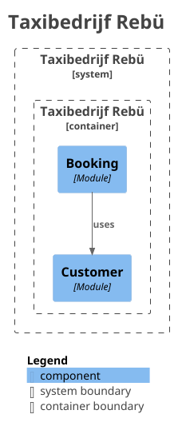

# Hexagonal Architecture Workshop
Deze repository bevat alle documentatie en code voor het kunnen geven van een workshop met als onderwerp Hexagonal
Architecture.

- [Onboarding](docs/assignment-diagrammen/onboarding.md)
- [Architectuur](docs/assignment-diagrammen/architectuur.md)

## Leerdoelen
1. Hoe kan je op een onderhoudbare manier een grote applicatie neerzetten?
2. Het explicieter toepassen van bekende concepten door te communiceren in termen van patterns (DI, IoC, etc.)

# De opdracht
We gaan een deel van een taxibedrijf casus uitwerken in een bestaand project in hexagonale architectuur en modulaire monoliet stijl. 
Het doel van de architectuur is om de verschillende domeinen geïsoleerd op te zetten terwijl het een monolitische applicatie betreft en hierbij de domein implementatie ook zoveel mogelijk techniek onafhankelijk te laten zijn. 
Dit betekent dat we slim moeten omgaan met de communicatie tussen domeinen en bij de koppeling aan specifieke technologieën.

## Casus 'taxibedrijf Rëbu'
Het systeem omvat functionaliteiten voor klanten en planners om te komen tot taxiritafspraken. 
In de gebruikersflow (zie event storming afbeelding) kan een klant simpelweg met zijn telefoonnummer een boeking aanvragen zodat een planner hiermee aan de slag gaat. 
Het systeem bepaalt initieel de beschikbaarheid en de planner maakt hierop beslissingen. 
Kan een boeking niet direct worden vervuld, dan kan het systeem ook alternatieve opties bepalen. 
Lukt het echt niet, dan wordt een aanvraag geweigerd.


Vanuit de event storming zijn de volgende drie domeinen te onderkennen:

  
(vertaald: Customer, Booking, Planning)
U = upstream
D = downstream

In scope van de workshop is een gedeeltelijke realisatie van de Customer en Booking context (waarbij booking afhankelijk is van upstream Customer). 
We pakken hierbij de "aanvraag indienen" en "klant registreren" commands.

## Beginstaat van het project
Meegeleverd op de workshop starter branch is een Java Spring Modulith project met een geïmplementeerde `customer` module en package opzet van de `booking` module.
In de `customer` module zijn er een tweetal REST endpoints beschikbaar en een Modulith named interface `CustomerApi` die registratie functionaliteit beschikbaar stelt die we gaan gebruiken in de Booking module later in de workshop.  


Deze `booking` module zullen we stapsgewijs implementeren volgens de hexagonal architecture stijl. De packagestructuur ziet er als volgt uit:  
  

## Stap 1: Implementeren van het Booking domein
We gaan beginnen met de domeinlaag van de Booking module (`nl.quintor.workshop.booking.domain` package), de packagestructuur is al aanwezig in het project en zit als volgt in elkaar:   
- Model: dient de domeinmodellen te bevatten
- Port.inbound: bevat interfaces die business functionaliteit van het domein beschikbaar stellen 
- Port.outbound: bevat interfaces die de domeinlaag nodig heeft van de buitenwereld, zoals repositories 
- Service: bevat de implementatie van de business logica van het domein, is afhankelijk van de Port.outbound interfaces en implementeert de Port.inbound interfaces

**A.** Maak een ```Booking``` en ```BookingStatus``` klasse aan in de `model` package met properties op basis het onderstaande diagram. 
Maak er lombok ```@Value``` klasses van die met een builder te initialiseren zijn.  
    

**B.** We willen uiteindelijk een boeking in een relationele database opslaan, maar in het domein willen we niet van technische implementatie klassen afhankelijk zijn. 
Er moet echter wel een interface beschikbaar komen waarop we een actie voor het opslaan van het zojuist aangemaakte booking model kunnen uitvoeren. 
Maak daarom een BookingRepository interface aan in de `port.outbound` (want dit gaat om uitgaande communicatie) package met een `save` methode met `Booking` als parameter en als return type. 
**Met uitzondering van de `model` package, mag deze klasse geen andere dependencies hebben.**  

**C.** Hoewel het domeinmodel een `customerId` bevat, willen we in onze functionaliteit voor het aanmaken van een booking niet een customer id ontvangen. 
Het moet mogelijk zijn simpelweg een telefoonnummer op te geven naast de aanvraaginformatie. 
Het koppelen van de booking aan een al dan niet bestaand klantprofiel op basis van het telefoonnummer regelen we in een latere stap. 
Maak voor nu een `NewBookingCommand` record aan met properties:
```java
String customerPhoneNumber,
LocalDateTime dateTime,
String fromLocation,
String toLocation,
byte numberOfPassengers
```
Het betreft hier een command die overeenkomt met het 'Aanvraag indienen' command in het eerdere event storming diagram. 
Een command veranderd de gegevenstoestand van een domein als deze succesvol is uitgevoerd.

**D.** Nu kunnen we het command beschikbaar stellen via een interface met de aangemaakte `NewBookingCommand` als parameter en een `Booking` als return type. 
Maak een interface aan in de `port.inbound` package (want dit gaat om ingaande communicatie) genaamd `BookingApi` met een methode `createBooking` hiervoor. 
**Met uitzondering van de `model` package, mag deze klasse geen andere dependencies hebben (voor nu).**   

**E.** Er staan nu een model, inbound port en outbound ports klaar. 
Dan is het nu tijd om een service te maken die de boel aan elkaar knoopt: maak in de `service` package een `BookingService` klasse aan die de `BookingApi` interface implementeert. 
Deze klasse heeft een memberfield voor de `BookingRepository` interface. 
In de createBooking methode moet een `Booking` object worden gecreëerd op basis van de informatie in de `NewBookingCommand` en vervolgens worden opgeslagen via de `BookingRepository`. 
Voor nu gebruiken we een random UUID voor de `customerId`.

**Optioneel: meer weten over "ports", zie ['Definition of Inbound and Outbound Ports'](<https://scalastic.io/en/hexagonal-architecture-domain/#1-definition-of-inbound-and-outbound-ports>) (5 min)**

**Optioneel: wat toelichting op keuzes**
- De service klasse heeft als 'logica' nu alleen het omzetten van het command naar een Booking, maar dit is ook de plek om business logica te plaatsen. 
  Het is dan minder toepasselijk om een mapper te maken die command naar booking omzet, ook gezien de properties niet één op één overeenkomen. 
  Daarom maken we hier deze keuze om programmatisch NewBookingCommand om te zetten. 
- In een daadwerkelijke implementatie wil je dat de `createBooking` methode een transactie aftrapt. 
  We maken de keuze om hiervoor de Spring Framework `@Transactional` annotaties te gebruiken. 
  Ja, er is dan koppeling met een framework, maar we kunnen dit alsnog beperken tot een specifieke subset (transactie annotaties). 
  Tevens zijn annotaties in de domein laag te elimineren, maar voor deze workshop een te abstracte en complexe oplossing.

**F.** Maak van de `getOrCreateCustomer` methode een transactie door middel van de `org.springframework.transaction` dependency. 

Als het goed is, ziet het domein binnen de booking module er nu als volgt uit:  
  


## Stap 2: Booking persistentie  
Er staat nu een domeinlaag met duidelijk gedefinieerde operaties zowel inbound als outbound. Vanuit het perspectief van het domein is het nu klaar, alles wat het voor nodig heeft kan het gebruiken door middel van de ports en eigen logica. Uiteindelijk moet er echter natuurlijk een systeem draaien en data worden opgeslagen. De **ports moeten worden geïmplementeerd met de techniek.** Wat we hier gebruiken maakt voor het domein niet uit, we gaan namelijk technische adapters schrijven die dit op zich nemen. 

**A.** Eerder is al genoemd dat we een relationele database willen gebruiken. We gaan dit realiseren door gebruik te maken van Spring Data JPA en een in-memory H2 database. Bij het aanmaken van het model hebben we niet de bekende JPA-annotaties toegevoegd zoals je dat mogelijk gewend bent in een lagenarchitectuur. Het model willen we voor de loskoppeling van database technologie dan ook zo houden.  
We hebben dus wel een variant nodig van Booking die wél JPA-annotaties heeft. Deze moet gaan leven in de adapter outbound laag. Kopieer ```Booking``` als ```BookingEntity``` naar ```adapter.outbound.persistence``` en voeg de JPA-annotaties ```@Entity, @Id & @GeneratedValue``` toe op de gepaste plaatsen. En oja, vergeet niet de Lombok annotaties te gebruiken die ervoor zorgen dat de entity manager dynamisch de objecten kan aanpassen! (dus geen value object zoals ```Booking``` is dat wel is).  

**B.** Zoals je weet van JPA-repositories, moet er een interface worden aangemaakt die overerft van ```JpaRepository```. We kunnen dus niet direct de ```BookingRepository``` interface van het domein implementeren, omdat deze geen JpaRepository is en andere methode (signatures) heeft. We moeten dus een adapter maken die de BookingRepository interface implementeert en intern gebruik maakt van een JPA repository, maar ook de mapping verzorgt tussen wat JPA kent (BookingEntity) en wat het domein kent (Booking).  
De volgende classes heb je daarom eerst nodig in de persistence package:  
- ```SpringDataBookingRepository```
```java
  @Repository
  public interface SpringDataBookingRepository extends JpaRepository<BookingEntity, Long> {
  }
```
- ```BookingEntityMapper```
```java
@Mapper(componentModel = "spring")
public interface BookingEntityMapper {

    BookingEntity toEntity(Booking booking);

    Booking toDomain(BookingEntity entity);
} 
```  

**C.** De tools om met JPA te kunnen werken staat nu klaar, nu moeten we ze bij elkaar brengen in een implementatie voor ```BookingRepository```. Maak een klasse ```H2BookingRepository``` aan die de ```SpringDataBookingRepository``` en ```BookingEntityMapper``` klasses gebruikt om de interface methode te implementeren. Annoteer hem met ```@Repository``` (over bean management later meer!).  
Als het goed is ziet het project er nu als volgt uit:  
  

## Stap 3: Booking REST API 
Het systeem kan nu draaien met een daadwerkelijke implementatie voor de dataopslag. Daarmee kan ```BookingApi``` (in runtime) echt worden gebruikt. We willen de functionaliteit beschikbaar stellen via een REST API. Wanneer clients ons systeem gaan gebruiken, dan valt dat onder de noemer ```inbound```. Maar we hebben onze ```BookingApi``` ook in inbound gezet, terwijl dit niet een HTTP implementatie betreft? Dat zit zo: vanuit de inbound package in de domeinlaag wordt gedefinieerd wat er **intern** kan worden gedaan qua use cases, de inbound package in de adapter laag gaat over wat externen met ons systeem kunnen doen en heeft de verantwoordelijkheid hier technisch in te voorzien (in dit geval kiezen we voor een Spring Web REST controller). De adapter lust dit door naar de ```BookingApi```. Dus geen implementatie zoals bij outbound, maar wel hetzelfde concept van het domein lopsgekoppeld laten staan van de buitenwereld.  

**Optioneel: wat toelichting op keuzes**  
- Je zult mogelijk nu vinden dat de ```BookingApi``` al een vrij duidelijk contract biedt voor clients om te gebruiken en dus direct in de controllers. We kiezen er echter voor dit ten alle tijden te voorkomen. We willen niet dat de types van het interne domein direct in controllers worden gebruikt voor een requests en responses. Een belangrijke argument hiervoor is dat er altijd expliciet moet worden nagedacht wat wel en wat niet wordt exposed naar buiten. Stel dat er gevoelige informatie in ```Booking``` komt te staan, dan is het heel handig als we altijd al het werken met request/response dto's om mogelijke fouten hierbij te voorkomen.  
Een nadeel van deze keuze is natuurlijk dat er meer code moet worden geschreven en ook dat input validatie tweemaal moet worden geïmplementeerd, zowel voor de controller dto's als de types die ```BookingApi``` gebruikt. 

**A.** We hebben request en response dto's nodig voordat we een endpoint kunnen maken. Eerder is genoemd hoe, terwijl ```Booking``` werkt met een ```customerId```, willen we voor clients dat ze een aanvraag kunnen doen met enkel opgave van een telefoonnummer. Maak daarom in ```adapter.inbound.web``` het volgende record aan als ```BookingPostDto```:
```java
public record BookingPostDto(String customerPhoneNumber,
                             LocalDateTime dateTime,
                             String fromLocation,
                             String toLocation,
                             byte numberOfPassengers) {
}
```  
Maak zelf nu ook een ```BookingResponseDto``` Record aan, deze is wel een-op-een gelijk aan Booking qua properties. 

**B.** Maak nu een ```@RestController``` ```BookingSpringController``` klasse aan in dezelfde package als de dto's en implementeer deze door gebruik te maken van de ```BookingApi``` port. Doet dit door een POST /bookings endpoint te maken, deze:  
1. Neemt een BookingPostDto als request body
2. Maakt hier een NewBookingCommand van aan
3. Roept de createBooking methode van BookingApi aan met het command
4. Returned een BookingResponseDto met de gegevens van de aangemaakte booking
5. Returned een HTTP status code 201 Created

**C.** Als het goed is, ziet het project er nu als volgt uit:  
  

**Hoe zit het nu met bean management?**  
We hebben nu in de adapter laag op de gebruikelijke manier beans gemaakt met de gebruikelijke Spring annotaties. Mogelijk vraag je je af hoe dat echter zit voor ```BookingService```, want we hebben immers ook hiervoor het dependency inversion principe toegepast gezien de controller via de ```BookingApi``` interface praat.  
Omdat de verantwoordelijkheid in de adapter laag ligt bij het implementeren van de techniek, specifiek aan Spring, gebruiken we daar gemakkelijk ook dus de component annotaties. Het domein houden we echter grotendeels onafhankelijk van Spring (met uitzondering van transacties). Om alsnog de dependency injection te regelen voor BookingApi, configureren we dit in een aparte configuration klasse.  


**D.** Maak in ```config``` de volgende klasse ```BookingModuleConfiguration``` aan, zodat ```BookingApi``` een implementatie in runtime beschikbaar heeft.  
```java
@Configuration
public class BookingModuleConfiguration {
    @Bean
    public BookingApi bookingApi(
            BookingRepository bookingRepository) {
        return new BookingService(bookingRepository);
    }
}
```

**E.** Laten we kijken of het werkt, run ```FunctionalIT``` in de test directory. De test ```createNewBooking_ValidBooking_StoresBookingInDB``` zou moeten slagen indien bovenstaande stappen correct zijn uitgevoerd. De overige tests kun je voor nu negeren.  

## Stap 4: architectuur validatie met ArchUnit

**ArchUnit**
[ArchUnit](<https://www.archunit.org/>) is een test library die helpt bij het afdwingen van architectuurregels. We hebben in de workshop al veel keuzes gemaakt op het gebied van 
architectuur, maar hoe zorgen we ervoor dat deze ook daadwerkelijk worden nageleefd?

**A.** Open `ArchUnitHexagonalTest` in de test directory en neem deze even door. Run de tests ook een keertje. Als het goed is slagen ze allemaal, 
want we hebben in de voorgaande stappen de regels van deze tests opgevolgd en de beginstaat van het project ook en daarmee voldaan aan de architectuur. 

**B.** Er zijn natuurlijk foutjes die je kan maken die vrij duidelijk zijn, zoals het gebruiken van een service in een model of in een controller 
direct te praten met een repository in plaats van via een service. De tests zorgen er gelukkig voor dat dit soort dingen aan het licht zouden komen in een pipeline.
Er zijn echter ook fouten die minder duidelijk zijn en komen vanuit deze specifieke hexagonal stijl die wij toepassen. In de loop van de tijd kan het toepassen van deze architectuurstijl
in een specifieke context best wel complex worden. Zeker wanneer er meerdere domeinen zijn waar meerdere developers aan werken, kunnen er subtiele fouten worden gemaakt. Pas bijvoorbeeld eens het volgende toe:  
- Voeg memberfield `CustomerResponseDto dto = null;` toe aan interface `CustomerApi` in de Customer domain inbound port laag (aan een methode zou realistischer zijn, maar we willen even geen compilatiefouten)  
- Voeg memberfield `private final SpringCustomerManager customerManager;` toe aan klasse `BookingSpringController` in de Booking inbound adapter laag  
Run nu de tests. **Wat** faalt er **en waarom** zou je dat verwachten met deze architectuur?  


## Stap 5: Booking uitbreiden met informatie vanuit het Customer domein
We gaan nu daadwerkelijk wat doen met de customer informatie die we al hebben klaargezet in de ```BookingPostDto``` en ```Booking``` model. Terugkijkend naar de eerdere context map, zien we dat Booking downstream is van Customer. Deze bounded context afhankelijk gaan we laten terugkomen in de implementatie, het project reflecteert daarmee letterlijk 'de business'. We gaan dit ondersteunen door middel van ```Spring modulith```. 

**A.** Analyseer ```domain.inbound.port``` in de ```Customer``` module. Je ziet hier een command en reply die is gemaakt voor de registratie command en 'event' uit het eerdere event storming diagram. We willen nu dat bij het aanmaken van een booking, dit command ook wordt uitgevoerd als onderdeel van de flow. Dit houdt in dat het telefoonnummer verkregen vanuit de dto en vervolgens het ```NewBookingCommand``` als payload wordt gebruikt om een customer id te verkijgen vanuit de custoemr module.  

**Hoe gaan we dit in hexagonal stijl doen?**  
Normaal gesproken zou je in een monoliet als deze simpelweg een CustomerService kunnen gebruiken in de BookingService en zodoende sterk gekoppeld zijn in de domain layer. Dit betekent echter dat wanneer er in de toekomst bijvoorbeeld een architectuurwijziging plaatsvindt waarbij Customer een microservice wordt, dan moet er een refactor plaatsvinden zodat het booking domein op een andere manier alsnog aan de customer informatie komt.  
Het zou dan echter een refactor zijn op de domeinlaag, terwijl het eigenlijk een technische wijziging is. Want vanuit het booking perspectief is er in principe niets gewijzigd, dezelfde informatie moet worden verzonden en verkregen. We gaan het daarom loose coupled opzetten met de kracht van de hexagonal stijl. Dit betekent wederom weer extra code, maar we krijgen er onderhoudbaar-, uitbreidbaar-, testbaarheid en meer voor terug.  

**B.** Bedenk eerst voor jezelf of overleg met anderen hoe je de volgende uitdaging zou oplossen met de kennis die je nu hebt: ```hoe zorgen we ervoor dat de customer module letterlijk uit het project kan worden verwijderd, zonder dat er compile errors op het niveau van de booking domeinlaag ontstaan terwijl deze laag wel iets doet met de custoemr domein functionaliteit?```

**Als antwoord op bovenstaande vraag, moeten we rekening houden met:**    
- De command en reply klasses in de inbound port van de customer module mogen niet in de domeinlaag van de booking module worden gebruikt, want dan kan de customer module niet worden verwijderd zonder refactor in de andere module
- Vergelijkbaar met wat we met de repositories hebben gedaan, mag de ```BookingService``` niet direct praten met een klasse die de calls naar de ```CustomerApi``` verzorgen, er is dus weer een outbound port nodig
- Om het punt hierboven voor elkaar te krijgen is er wederom weer een technische adapter nodig 

**C.** De ports van het booking domein moeten los blijven staan van de customer module, maak daarom een eigen versie van het command en reply aan in de ```domain.outbound.port``` package van de booking module met record klasses ```GetOrCreateCustomerRequest```:
```java
public record GetOrCreateCustomerRequest(String phoneNumber) {
}
```

en ```GetOrCreateCustomerResponse```:
```java
public record GetOrCreateCustomerResponse(String customerId) {
}
```
**D.** Maak een **interface** klasse ```CustomerManager``` aan die de bovenstaande types gebruikt als in- en output (respectievelijk) voor een methode ```getOrCreateCustomer```. Dit is alles wat de ```BookingService``` nodig heeft om zijn flow te kunnen uitvoeren.

**E.** Breid dan ook nu met de tools van stappen c en d de ```BookingService``` in de ```service``` package uit ter realisatie van de volgende flow:  
1. Het customer telefoonnummer wordt gehaald uit het binnengekomen ```NewBookingCommand``` argument
2. De ```CustomerManager``` wordt gebruikt om een ```GetOrCreateCustomerRequest``` te maken en te versturen
3. Uit het response van de manager, pak je het customerId en maak je een ```Booking``` aan zoals eerder, maar dan met het verkregen customerId in plaats van een random UUID
4. De booking wordt opgeslagen zoals eerder via de ```BookingRepository```

**Het booking domein is nu gereed, ongeacht waar de customer informatie vandaan komt (e.g. in de monoliet zelf, of een externe microservice), de business logica hoeft niet worden aangepast!**

**F.** We gaan nu een technische implementatie leveren in de vorm van een adapter die binnen het Spring process de methode calls gaat doen naar wat in run time daadwerkelijk de ```CustomerService``` is, welke een implementatie is van ```CustomerApi```.  
Net zoals bij de repositories, realiseren we dit in de ```adapter.outbound``` package van Booking. Maak in de child package `manager.spring` een klasse ```SpringCustomerMapper```:   
```java
@Mapper(componentModel = "spring")
public interface SpringCustomerMapper {

    GetOrCreateCustomerCommand toCommand(GetOrCreateCustomerRequest request);

    GetOrCreateCustomerResponse fromReply(GetOrCreateCustomerReply reply);
}
```

Een mapper is hier een makkelijke keuze omdat we in-process in principe dezelfde data overbrengen. Je kunt je voorstellen dat in een microservice adapter hier eerst nog dto's moeten worden gemaakt als de properties bijvoorbeeld JSON-naamgeving annotaties nodig hebben.  
Maak vervolgens de adapter klasse ```SpringCustomerManager``` die ```CustomerManager``` implementeert (Spring wordt hier gezien als de technologie van in-process code calls, het is dus gewoon een adapter op de applicatie zelf eigenlijk). Gebruik de aangemaakte mapper en de ```CustomerApi``` uit de customer module om de methode te implementeren.  


**G.** Als het goed is ziet het project er nu als volgt uit (let op: vereenvoudigd tot hoofdzakelijk de nieuwe klasses uit stap 5):  


**H.** Laten we kijken of het werkt, run ```FunctionalIT``` in de test directory. De drie tests die beginnen met ```getAllCustomers_``` zouden moeten slagen. De overige tests kun je voor nu negeren.

**Spring Modulith**  
In de pom van het project is al een dependency toegevoegd voor Spring Modulith. Deze tool helpt bij het structureren van een monolitische applicatie in modules en het afdwingen van de regels die daarbij horen. Het zorgt ervoor dat de modules losgekoppeld blijven en dat de afhankelijkheden tussen modules duidelijk zijn. Of dit correct is gedaan zijn er [default rules](<https://docs.spring.io/spring-modulith/reference/verification.html>) die met een verify API kunnen worden gecheckt.  
Omdat we nu twee modules (Customer en Booking root directories worden als modules gezien door Modulith) hebben voor twee bounded contexts, willen we modulith gebruiken om ons te helpen bij het in de gaten houden dat we niet onbedoeld klasses van de ene context in de andere gaan gebruiken. 

**I.** Run de test ```ModulithTest``` in de ```test``` directory, deze faalt als het goed is. Lees de foutmelding die hierbij wordt gegeven.  
We hebben in de adapter laag van Booking een koppeling gelegd met klasses uit Customer. Dat mag niet zomaar van Modulith, de klasses moeten namelijk eerst worden [exposed via een API package of named interface](<https://docs.spring.io/spring-modulith/reference/fundamentals.html#modules.named-interfaces>).  
```CustomerApi``` en de command en reply klasses zullen moeten worden exposed. We kiezen ervoor om dit in ```inbound.port``` te laten staan (kun je over discussiëren), daarom is het nodig dat deze package of iedere klasse een named interface wordt. We kiezen voor het gemak om de gehele package een named interface te maken.  
Maak bestand ```package-info.java``` in de package met definitie:  
```java
@NamedInterface
package nl.quintor.workshop.customer.domain.port.inbound;

import org.springframework.modulith.NamedInterface;
```  

Run nu nogmaals de ```ModulithTest```, ```verifyModules``` zou nu moeten slagen.  
Een leuke feature van Modulith is dat er in de targer directory een puml diagram wordt gegenereerd die de afhankelijkheden tussen de modules laat zien, en wat blijkt? Het komt precies overeen met de eerdere context map!  
  

## Stap 6: Validation en exception handling

## Stap 7: CustomerManager Spring adapter vervangen door REST adapter  
Als het customer domein op een gegeven moment geen onderdeel meer is van de Rebü applicatie, maar een losse applicati, dan zal deze via een andere API gekoppeld moeten worden.
In de workshop gaan we niet daadwerkelijk een aparte applicatie opzetten vanwege tijdsredenen. We gaan indirect de CustomerController gebruiken door met een REST client tegen onszelf te praten. 
We gaan hiervoor de `SpringCustomerManager` adapter vervangen door een nieuwe `RestCustomerManager`. 
Merk op dat je bij deze refactoring geen logica in het booking domein hoeft aan te passen.

**A.** Het REST API contract is als volgt: PUT op /customers/phoneNumber welke een dto terugstuurt met `id` als property. Deze gaan we nodig hebben als `customerId` property in `Booking`. Voor de SpringAdapter moesten we een command en reply mappen, maar hier moeten we dus mappen op de REST API.
Maak daarom een `RestCustomerResponseDto` record klasse aan in de `adapter.outbound.manager.rest` package van Booking:  
```java
public record RestCustomerResponseDto(UUID id,
                                      String phoneNumber){
}
```

Deze kan het API-response parsen. We moeten uiteindelijk toewerken naar een return type `GetOrCreateCustomerResponse` om het interface te implementeren dat de domainlaag kent. Deze werkt met `customerId` naamgeving i.p.v. `id` Maak daarom ook een mapper aan genaamd `RestCustomerDtoMapper`:  
```java
@Mapper(componentModel = "spring")
public interface RestCustomerDtoMapper {
    @Mapping(source = "id", target = "customerId")
    GetOrCreateCustomerResponse toGetOrCreateCustomerResponse(RestCustomerResponseDto dto);
}
```  
Zoals je ziet lost deze de property naamgeving mismatch op.  

**B.** We gaan dan nu de aangemaakte dto en mapper gebruiken om de nieuwe adapter te implementeren. Maak een klasse `RestCustomerManager` die `CustomerManager` implementeert. Geef deze klasse ook een memberfield `private final RestClient restClient`. Deze is al verzorgd in de configuratie.
Implmenteer nu de adapter door:  
1. `restClient.put()` te gebruiken voor een call naar localhost 8080
2. Het endpoint is `/customers/{phoneNumber}` waarbij `phoneNumber` afkomstig is van de `GetOrCreateCustomerRequest`
3. Parse de response via `RestCustomerResponseDto`
4. Map de response naar `GetOrCreateCustomerResponse` via de mapper en return dit

**C.** Voordat we deze adapter in runtime gaan gebruiken, check nog een keer of de tests die starten met `getAllCustomers` en `createNewBooking_ValidBooking_StoresBookingInDB` uit `FunctionalIT` nog steeds slagen. 
Is dat het geval, comment dan in `SpringCustomerManager` `@Component` uit. Voeg aan `RestCustomerManager` de annotatie `@Component` toe. Run de tests opnieuw, ze zouden nog steeds moeten slagen. Is dat het geval, dan heb je zonder problemen
een technische implementatie vervangen, terwijl er op domeinniveau geen wijzigingen nodig waren! 


TODO: project eindstaat diagram hier