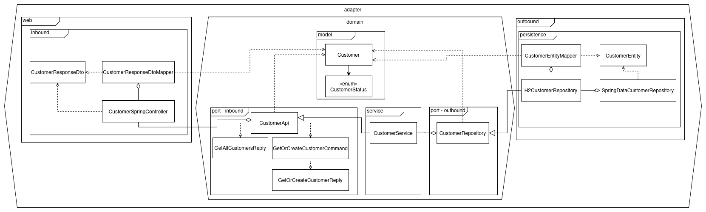

# Hexagonal Architecture Workshop
Deze repository bevat alle documentatie en code voor het kunnen geven van een workshop met als onderwerp Hexagonal
Architecture.

- [Onboarding](docs/onboarding.md)
- [Architectuur](docs/architectuur.md)

## Leerdoelen
1. Hoe kan je op een onderhoudbare manier een grote applicatie neerzetten?
2. Het explicieter toepassen van bekende concepten door te communiceren in termen van patterns (DI, IoC, etc.)

## Extra informatie
1. Voor het geven van de workshop is 1,5 uur benodigd

# De opdracht
We gaan een deel van een taxibedrijf casus uitwerken in een bestaand project in hexagonal stijl. Het doel van de architectuur is om de domeinen uitbreidbaar op te zetten terwijl het een monolitische applicatie betreft en hierbij ook framework onafhankelijk te zijn. Dit betekent dat we slim moeten omgaan met de communicatie tussen domeinen en bij de loskoppeling van de "business" aspecten van framework/data/services etc. specifieke technologie.

## Casus 'taxibedrijf Rëbu'
Het systeem omvat functionaliteiten voor klanten en planners om te komen tot bevestigde taxiritafspraken. In de gebruikersflow (zie afbeelding) kan een klant simpelweg met zijn telefoonnummer een boeking aanvragen zodat een planner hiermee aan de slag gaat. Het systeem bepaalt initieel de beschikbaarheid en de planner maakt hierop beslissingen. Kan een boeking niet direct worden vervuld, dan kan het systeem ook alternatieve opties bepalen. Lukt het echt niet, dan wordt een aanvraag geweigerd.

Vanuit de event storming zijn de volgende drie domeinen te onderkennen:

(vertaald: Customer, Booking, Planning)
U = upstream
D = downstream

In scope van de workshop is een gedeeltelijke realisatie van de Customer en Booking context (waarbij booking afhankelijk is van upstream Customer). We pakken hierbij de "aanvraag indienen" en "klant registreren" commands.

## Beginstaat van het project
Meegeleverd op de workshop starter branch is een Java Spring project met een geïmplementeerde Customer module en package opzet van de Booking module. Er is een endpoint beschikbaar voor het vekrijgen van alle customers en een Modulith named interface 'CustomerApi' die registratie functionaliteit beschikbaar stelt die we gaan gebruiken in de Booking module later in de workshop.  

## Stap 1: introduceren van het Booking domein
We gaan beginnen met de domeinlaag van de Booking module, de packagestructuur is al aanwezig in het project en zit als volgt in elkaar: 
Domain package:  
- Model: dient domeinmodellen te bevatten
- Port.inbound: bevat interfaces die beschikbaar zijn voor de 

